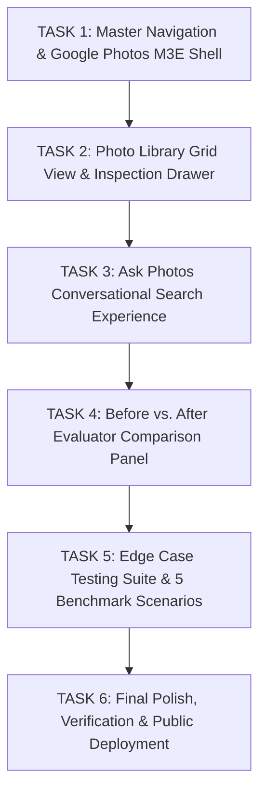

# 🚀 Google Photos Episodic Retrieval MVP: Roadmap & Solution Blueprint (`MVP.md`)

---

## 1. 🎯 Executive Problem Definition & Graduation Project Goal

### The Problem: The "Semantic Recall Gap"
Over years of usage, Google Photos users accumulate tens of thousands of personal media assets (photos, screenshots, medical slips, recipes, travel snapshots). 

Traditional search in Google Photos is optimized for **explicit keyword indexing** (EXIF dates, GPS tags, album names, exact labels). However, human cognition does not store memories as structured metadata:
- **What users recall (88% of human memory anchors)**: Emotional states, sensory colors, ambient environment, relative timeframes, co-occurring events (*"when I had a fever last winter"*, *"that beach cafe with blue chairs in Goa"*).
- **What users forget (88% of database tags)**: Exact calendar dates, GPS coordinates, camera filenames (`IMG_20240114.jpg`), exact OCR wording.

### The Solution: "Google Photos Ask Photos (Episodic Search Engine)"
An AI-powered, Material Design 3 Expressive web application that mimics Google Photos' latest **"Ask Photos"** feature (powered by multimodal generative retrieval). It bridges the semantic gap by translating vague, episodic user clues into candidate visual concepts, OCR tokens, and relative temporal filters to retrieve the exact photo users vaguely remember.

---

## 2. 📱 Core Solution Architecture & Feature Matrix

The MVP application is designed with **4 unified views** in a Google Photos Material 3 Expressive shell:

```
┌────────────────────────────────────────────────────────────────────────────┐
│                  GOOGLE PHOTOS MATERIAL 3 EXPRESSIVE UI                     │
├─────────────────┬──────────────────┬───────────────────┬───────────────────┤
│  📸 My Photos   │  ✨ Ask Photos   │  ⚖️ Before/After  │  📊 Review Pulse  │
│  (Library Grid) │  (AI Assistant)  │  (Evaluator Mode) │  (PM Telemetry)   │
└─────────────────┴──────────────────┴───────────────────┴───────────────────┘
```

### View 1: 📸 "My Photos" (Authentic Google Photos Library Grid)
- **Visual Masonry / Justified Grid**: Realistic Google Photos interface showing photo cards organized by month/year with pinch-zoom simulation.
- **Interactive Photo Inspection Drawer**: Clicking any photo opens a detail modal revealing:
  - Photo preview
  - EXIF metadata (date, camera, location)
  - Detected Visual Objects (e.g. *medicine box, glass of water, nightstand*)
  - Extracted OCR Text (e.g. *"Paracetamol 500mg Tablets BP"*)
  - AI Scene Description

### View 2: ✨ "Ask Photos" (Conversational Multimodal AI Assistant)
- **Material 3 Expressive Conversational Search Bar**:
  - Floating pill search bar with Gemini spark icon: *"Ask anything about your photos..."*
  - Interactive **Clue Chips** (*"when I was sick"*, *"beach in Goa"*, *"parking ticket"*, *"restaurant receipt"*, *"recipe"*).
- **Dual-Mode Response Engine**:
  - 📝 **Conversational Synthesis**: Direct natural language answer (*"I found the photo from January 14, 2025. It shows a Paracetamol box on your bedside nightstand."*).
  - 🧠 **Episodic Reasoning Card**: Explains how the AI connected the vague clues to the image (*"Mapped 'fever' → Paracetamol OCR + electronic thermometer reading 100.4°F"*).
  - 📷 **Retrieved Photo Cards**: Cards with match confidence score (`96% High Match`), category, and timestamp.
  - ❓ **Clarifying Context Loop**: When a query is ambiguous, Ask Photos asks up to 2 targeted follow-ups with clickable answer pills.

### View 3: ⚖️ "Before vs. After" (The Evaluator Proof-of-Value Panel)
*This is the primary tool for evaluators to test what changed and verify the problem solved.*
- **Side-by-side split screen**:
  - **Left (Legacy Google Photos Search)**:
    - User types *"medicine for fever last winter"*.
    - **Result**: `0 Photos Found (Search Miss)`.
    - **Why it failed**: EXIF metadata only knows date and filename; no metadata matches "fever".
  - **Right (Episodic AI Search Assistant - Our Solution)**:
    - Same query processed through our 3-stage RAG pipeline.
    - **Result**: `1 High-Confidence Match (IMG_20250114_091522)`.
    - **Why it succeeded**: Automated query expansion linked "fever" to Paracetamol OCR and thermometer visual descriptor.
- **5 Pre-loaded 1-Click Benchmark Scenarios**:
  1. *Health / Medical*: *"Medicine box when I had fever"*
  2. *Travel / Aesthetic*: *"Beach cafe with blue chairs in Goa"*
  3. *Financial / Paperwork*: *"Dinner bill from downtown Italian place"*
  4. *Family / Food*: *"Grandma's handwritten cookie recipe"*
  5. *Automotive / Parking*: *"Where did I park on level 3?"*

### View 4: 📊 "Review Pulse" (Executive Telemetry Dashboard)
- The existing, production-grade telemetry dashboard tracking **96,926 cleaned reviews across 13 platforms**, demonstrating customer demand, negative complaint trends (31.8% search failures), and platform divergence.

---

## 3. 🧠 The AI Retrieval Engine: How the Solution Works

```
  [User Episodic Query: "medicine box when I had fever last winter"]
                               │
                               ▼
     ┌──────────────────────────────────────────────────┐
     │           1. EPISODIC QUERY EXPANDER             │
     │  • Detects symptom/occasion: "fever"             │
     │  • Expands to: Paracetamol, thermometer, pills   │
     │  • Relative timeframe: "last winter" → Nov-Feb   │
     └─────────────────────────┬────────────────────────┘
                               │
                               ▼
     ┌──────────────────────────────────────────────────┐
     │      2. MULTIMODAL VECTOR SIMILARITY MATCHER     │
     │  • Matches against AI Visual Scene Descriptions  │
     │  • Matches against Extracted OCR Text Tokens     │
     │  • Matches against Detected Object Labels        │
     └─────────────────────────┬────────────────────────┘
                               │
                               ▼
     ┌──────────────────────────────────────────────────┐
     │     3. CONFIDENCE SCORING & REASONING AGENT      │
     │  • Computes normalized cosine similarity (0-100%)│
     │  • Formulates conversational reasoning summary   │
     │  • Highlights retrieved photo cards              │
     └──────────────────────────────────────────────────┘
```

---

## 4. 🛡️ Edge Cases & Guardrails Matrix (From Case Study)

| Code | Edge Case | Vulnerability | System Mitigation Strategy |
| :--- | :--- | :--- | :--- |
| **EC-01** | **Zero Memory Anchors** (*"that photo from somewhere"*) | Hallucination / Over-retrieval | Detect anchor score < 0.3. Trigger **Guided Clarification Mode**: Ask 2 structured questions with clue pills (*"Indoors or outdoors?"*, *"Approximate year?"*). |
| **EC-02** | **Contradictory Clues** (*"beach in Delhi"*) | Zero results | Relax strict spatial constraint; notify user: *"Delhi has no coastline, but here are beach photos from your Goa trip."* |
| **EC-03** | **Missing EXIF / Geotag** | Traditional search skips item | Match purely on OCR text and visual scene descriptors. |
| **EC-04** | **Multi-Asset Ambiguity** | Overwhelmed user | Cluster candidates by occasion with confidence ranking. |
| **EC-05** | **Code-Switching / Hinglish** (*"dawai ki photo"*) | Keyword search miss | Cross-lingual semantic dictionary maps *"dawai"* → *medicine / pharmacy*. |

---

## 5. 🗺️ Step-by-Step Implementation Roadmap (Pick 1 by 1)



### 🔹 Task 1: Master Navigation & Google Photos M3E Shell
- Unify top app header with authentic Google Photos styling: Search pill bar, Pinwheel SVG, user profile badge, and Material 3 segmented navigation switcher (`📸 Photos`, `✨ Ask Photos`, `⚖️ Before vs After`, `📊 Review Pulse`).

### 🔹 Task 2: Photo Library Grid View & Detail Drawer
- Build an authentic Google Photos masonry photo grid with dates, category badges, and thumbnail cards.
- Implement an interactive click-to-inspect drawer displaying EXIF metadata, visual scene tags, and extracted OCR text.

### 🔹 Task 3: Ask Photos Conversational Search Experience
- Upgrade the AI assistant with floating conversational search, prompt clue chips, dual-mode summaries (conversational paragraph + point-wise takeaways), episodic reasoning card, and retrieved photo cards with confidence badges.

### 🔹 Task 4: Before vs. After Evaluator Comparison Panel
- Build the side-by-side split screen showing **Legacy Keyword Search** (0 results, failure analysis) vs. **Episodic AI Search** (successful retrieval with reasoning).

### 🔹 Task 5: 5 Pre-Loaded Benchmark Scenarios & Edge Cases
- Add 1-click test buttons for the 5 benchmark queries (Medical, Travel, Receipt, Handwritten Recipe, Parking).
- Implement interactive demonstrations for EC-01 (Clarification prompts) and EC-02 (Contradictory clues).

### 🔹 Task 6: Final Polish & Public Deployment
- Verify all views on mobile and desktop.
- Push clean updates to GitHub and Streamlit Community Cloud.
